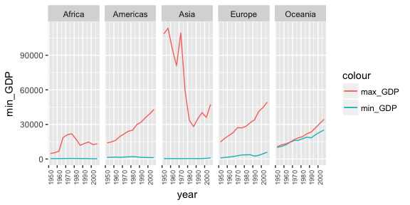
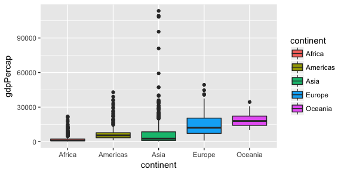
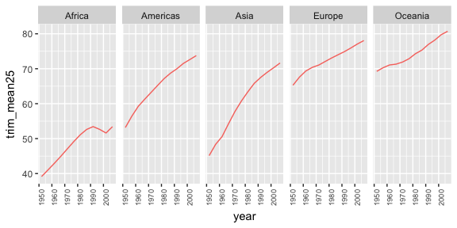
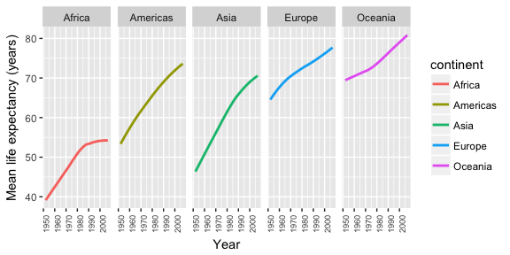

HW 03: Using dplyr and ggplot2 to manipulate and explore the gapminder dataset
================
Julian Heavyside
9/29/2017

Load relevant libraries

``` r
suppressPackageStartupMessages(library(tidyverse))
suppressPackageStartupMessages(library(gapminder))
knitr::opts_chunk$set(fig.width=6, fig.height=3)
```

Homework Tasks
==============

**Task 1**: Get the maximum and minimum of GDP per capita for all continents.

*First, a simple table to show the minimum and maximum GDP per capita for each continent, with data from all years lumped together. I've also included the GDP gap between max and min*

``` r
gapminder %>% 
  group_by(continent) %>% 
  summarise(min_GDP = min(gdpPercap), 
            max_GDP = max(gdpPercap), 
            gap = max(gdpPercap) - min(gdpPercap)) %>% 
  knitr::kable() # makes the table look prettier
```

| continent |    min\_GDP|   max\_GDP|        gap|
|:----------|-----------:|----------:|----------:|
| Africa    |    241.1659|   21951.21|   21710.05|
| Americas  |   1201.6372|   42951.65|   41750.02|
| Asia      |    331.0000|  113523.13|  113192.13|
| Europe    |    973.5332|   49357.19|   48383.66|
| Oceania   |  10039.5956|   34435.37|   24395.77|

*But we have data for a good period of time, so let's see how this has changed over the years for each continent. Has the gap grown or shrunk at all? (group by continent and year this time, then plot it*

``` r
gapminder %>%
  group_by(continent, year) %>% 
  summarise(min_GDP = min(gdpPercap), 
            max_GDP = max(gdpPercap)) %>% 
  ggplot(aes(year)) +
  geom_line(aes(y = min_GDP, colour = "min_GDP")) +
  geom_line(aes(y = max_GDP, colour = "max_GDP")) +
  facet_grid(~ continent) +
  # figured out that theme() can change things
  # this turns the years on the x axis sideways
  theme(axis.text.x = element_text(size = 7, angle = 90))
```



*From the 1950s through to the early 1980s, Asia showed a large deviation in per capita GDP compared to the other continents. Since the late 1980s, this seems to have smoothed out, and this metric has steadily risen as it has for the other continents.*

**Task 2**: Look at the spread of GDP per capita within the continents.

``` r
gapminder %>%
  ggplot(aes(x=continent, y=gdpPercap)) +
  geom_boxplot(aes(fill = continent), show.legend = F)
```



*Asia really stands out from the other continents in this figure. The spread between the low and high ends of per capitat GDP within Asian countries is massive, and by far the highest per capita GDPs in the world are found in Asia (as are some of the lowest)*

**Task 3**: Compute a trimmed mean of life expectancy for different years. Or a weighted mean, weighting by population. Just try something other than the plain vanilla mean.

``` r
trimmed <- gapminder %>% 
  group_by(continent, year) %>% 
  # to get a sense of how much to trim, I'll check out a set of trimmed means
  # ranging from 10-50%. This will dampen the influence of the greatly deviating
  # found in some countries
  summarise(trim_mean10 = mean(lifeExp, trim = 0.1),
            trim_mean25 = mean(lifeExp, trim = 0.25),
            trim_mean50 = mean(lifeExp, trim = 0.55))

glimpse(trimmed)
```

    ## Observations: 60
    ## Variables: 5
    ## $ continent   <fctr> Africa, Africa, Africa, Africa, Africa, Africa, A...
    ## $ year        <int> 1952, 1957, 1962, 1967, 1972, 1977, 1982, 1987, 19...
    ## $ trim_mean10 <dbl> 38.93298, 40.96993, 43.04819, 45.11750, 47.26495, ...
    ## $ trim_mean25 <dbl> 39.14381, 41.03831, 42.96412, 44.97027, 47.06935, ...
    ## $ trim_mean50 <dbl> 38.8330, 40.5925, 42.6305, 44.6985, 47.0315, 49.27...

*Looking at the data, there doesn't seem to be much difference among the means when trimmed to 10 or 50%, so I'll just use 25%*

``` r
trimmed %>% 
  ggplot(aes(year)) +
  geom_line(aes(y = trim_mean25, colour = "continent")) +
  facet_grid(~ continent) +
  theme(axis.text.x = element_text(size = 7, 
                                   angle = 90), 
        legend.position = "none")
```



**Task 4**: How is life expectancy changing over time on different continents?

``` r
gapminder %>% 
  group_by(continent, year) %>% 
  summarise(life_exp = mean(lifeExp)) %>% 
  ggplot(aes(year, life_exp)) +
  geom_smooth(method = "loess", aes(colour = continent), se = FALSE) +
  facet_grid(~ continent) +
  labs(x = "Year", y = "Mean life expectancy (years)") + 
  theme(axis.text.x = element_text(size = 7, angle = 90))
```



*Life expectancy seems to be on the rise across all continents, when lumping all countries together.*

The following tasks were not completed, but I will leave the prompts here in case I ever decided to come back to them
---------------------------------------------------------------------------------------------------------------------

**Task 5**: Report the absolute and/or relative abundance of countries with low life expectancy over time by continent: Compute some measure of worldwide life expectancy – you decide – a mean or median or some other quantile or perhaps your current age. Then determine how many countries on each continent have a life expectancy less than this benchmark, for each year.

**Task 6**: Find countries with interesting stories. Open-ended and, therefore, hard. Promising but unsuccessful attempts are encouraged. This will generate interesting questions to follow up on in class.
