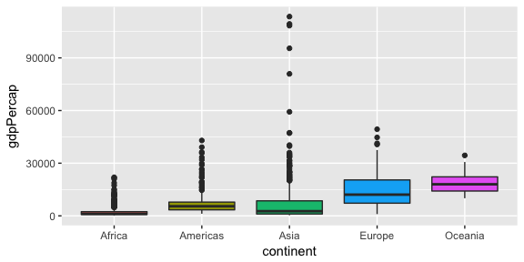

hw03: Using dplyr and ggplot2 to manipulate and explore the gapminder dataset
================
Julian Heavyside
9/29/2017

Load relevant libraries

``` r
suppressPackageStartupMessages(library(tidyverse))
suppressPackageStartupMessages(library(gapminder))
knitr::opts_chunk$set(fig.width=6, fig.height=3)
```

Homework Tasks
==============

**Task 1**: Get the maximum and minimum of GDP per capita for all continents.

*First, a simple table to show the minimum and maximum GDP per capita for each continent, with data from all years lumped together. I've also included the GDP gap between max and min*

``` r
fig1_table <- gapminder %>% 
  group_by(continent) %>% 
  summarise(min_GDP = min(gdpPercap), 
            max_GDP = max(gdpPercap), 
            gap = max(gdpPercap) - min(gdpPercap))
  
knitr::kable(fig1_table) # makes the table look prettier
```

| continent |    min\_GDP|   max\_GDP|        gap|
|:----------|-----------:|----------:|----------:|
| Africa    |    241.1659|   21951.21|   21710.05|
| Americas  |   1201.6372|   42951.65|   41750.02|
| Asia      |    331.0000|  113523.13|  113192.13|
| Europe    |    973.5332|   49357.19|   48383.66|
| Oceania   |  10039.5956|   34435.37|   24395.77|

*But let's see how this has changed over the years for each continent. Has the gap grown or shrunk at all? (group by continent and year this time, then plot it*

``` r
gapminder %>%
  group_by(continent, year) %>% 
  summarise(min_GDP = min(gdpPercap), 
            max_GDP = max(gdpPercap)) %>% 
  ggplot(aes(year)) +
  geom_line(aes(y = min_GDP, colour = "min_GDP")) +
  geom_line(aes(y = max_GDP, colour = "max_GDP")) +
  facet_grid(~ continent) +
  # figured out that theme() can change things
  # this turns the years on the x axis sideways
  theme(axis.text.x = element_text(size = 7, angle = 90))
```


**Task 2**: Look at the spread of GDP per capita within the continents.

``` r
gapminder %>%
  group_by(continent) %>% 
  ggplot(aes(year, gdpPercap)) +
  geom_point(aes(colour = continent)) +
  geom_smooth(aes(colour = continent), method = "lm", se = F)
```



Find out which country/countries show declining GDP per capita

``` r
# gapminder %>% 
#   group_by(continent)
#   lm(gdpPercap ~ year, .) %>% 
#   
```

**Task 3**: Compute a trimmed mean of life expectancy for different years. Or a weighted mean, weighting by population. Just try something other than the plain vanilla mean.

**Task 4**: How is life expectancy changing over time on different continents?

``` r
gapminder %>%
  group_by(continent) %>% 
  ggplot(aes(year, lifeExp)) +
  geom_point(aes(colour = continent)) +
  geom_smooth(aes(colour = continent), method = "lm", se = F)
```


**Task 5**: Report the absolute and/or relative abundance of countries with low life expectancy over time by continent: Compute some measure of worldwide life expectancy – you decide – a mean or median or some other quantile or perhaps your current age. Then determine how many countries on each continent have a life expectancy less than this benchmark, for each year.

**Task 6**: Find countries with interesting stories. Open-ended and, therefore, hard. Promising but unsuccessful attempts are encouraged. This will generate interesting questions to follow up on in class.
