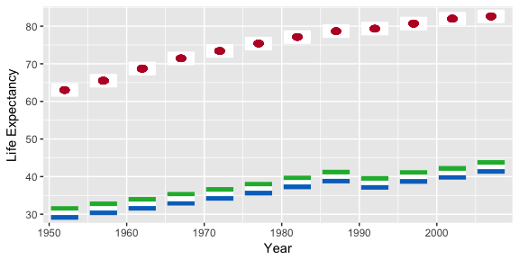
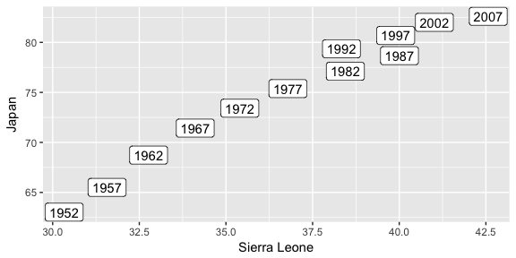

HW 04: Tidy Data and Joins
================
Julian Heavyside
10/10/2017

-   [Part 1 Activity 2: Make a tibble with one row per year and columns for life expectancy for two or more countries](#part-1-activity-2-make-a-tibble-with-one-row-per-year-and-columns-for-life-expectancy-for-two-or-more-countries)
-   [Part 2 Join, merge, look up](#part-2-join-merge-look-up)

### Part 1 Activity 2: Make a tibble with one row per year and columns for life expectancy for two or more countries

I'm working with the two countries with the highest and lowest life expectancies (based on the highest LE ever reached in those countries)

``` r
# a convoluted way to find the countries with the largest and smallest LE
gapminder %>%
  group_by(country) %>% 
  summarise(top_LE = max(lifeExp)) %>% 
  arrange(top_LE) %>% 
  slice(c(1, n())) #this returns the first and last row of the summarised and ordered data
```

    ## # A tibble: 2 x 2
    ##        country top_LE
    ##         <fctr>  <dbl>
    ## 1 Sierra Leone 42.568
    ## 2        Japan 82.603

Japan's record high LE is almost twice that of Sierra Leone!

Now, the filtered dataset:

``` r
siljap <- gapminder %>%
  select(year, country, lifeExp) %>% 
  filter(country == "Sierra Leone" | country == "Japan") %>% 
  spread(country, lifeExp) #create a column for each country
  
siljap %>% 
  knitr::kable(col.names = c("Year", "Sierra_Leone", "Japan"), align = "c")
```

| Year | Sierra\_Leone |  Japan |
|:----:|:-------------:|:------:|
| 1952 |     63.030    | 30.331 |
| 1957 |     65.500    | 31.570 |
| 1962 |     68.730    | 32.767 |
| 1967 |     71.430    | 34.113 |
| 1972 |     73.420    | 35.400 |
| 1977 |     75.380    | 36.788 |
| 1982 |     77.110    | 38.445 |
| 1987 |     78.670    | 40.006 |
| 1992 |     79.360    | 38.333 |
| 1997 |     80.690    | 39.897 |
| 2002 |     82.000    | 41.012 |
| 2007 |     82.603    | 42.568 |

I *hate* right aligned tables (`kable()`'s default alignment), so I was happy to discover the `align` parameter in the `kable()` function

Visualize the data (I found a cool [github package](https://github.com/baptiste/ggflags) created by [baptiste](https://github.com/baptiste) to plot images of country flags as data points. This is how you install and load the package from `babtiste`'s github repository

``` r
suppressPackageStartupMessages(library(devtools))
install_github("baptiste/ggflags")
```

    ## Skipping install of 'ggflags' from a github remote, the SHA1 (818a0e7e) has not changed since last install.
    ##   Use `force = TRUE` to force installation

``` r
suppressPackageStartupMessages(library(ggflags))
```

The space between "Sierra" and "Leone" causes problems when plotting, and I used [this stackoverflow question](https://stackoverflow.com/questions/6081439/changing-column-names-of-a-data-frame) to remind myself how to change column names

``` r
colnames(siljap)[which(names(siljap) == "Sierra Leone")] <- "Sierra_Leone"

siljap %>% 
  ggplot(aes(x = year)) +
  geom_flag(aes(y = Sierra_Leone, country = "sl"), size = 8) +
  geom_flag(aes(y = Japan, country = "jp"), size = 8) +
  xlab("Year") + 
  ylab("Life Expectancy")
```



Another way to compare the two countries is to plot them against eachother in a scatterplot. The current shape of the data is ideal for this. The two countries differ in LE so greatly that there is little point in plottin them with a line through the intercept to show a 1:1 ratio in LE. Japan is always ~2x greater than Sierra Leone

``` r
siljap %>% 
  ggplot(aes(x=Sierra_Leone, y=Japan)) +
  geom_point() +
  geom_label(aes(label = year)) +
  xlab("Sierra Leone")
```



In both graphs we can see a blip in the LE for Sierra Leone around 1992. Civil war broke out in the country in 1991, and the government was overthrown after a coup d'état in 1992. This appears to be associated with a decrease in life expectancy during these few years. Read more [here](https://en.wikipedia.org/wiki/Sierra_Leone_Civil_War)

### Part 2 Join, merge, look up
