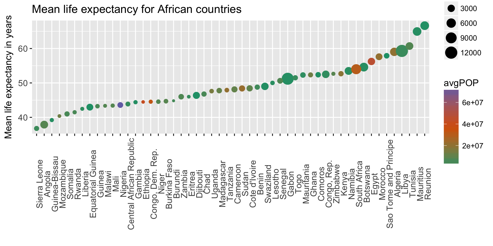

```{r, echo = FALSE}
#load relevant libraries
suppressPackageStartupMessages(library(tidyverse))
suppressPackageStartupMessages(library(gapminder))
suppressPackageStartupMessages(library(singer))
suppressPackageStartupMessages(library(forcats))
suppressPackageStartupMessages(library(gridExtra))
suppressPackageStartupMessages(library(RColorBrewer))
knitr::opts_chunk$set(fig.width=10, fig.height=6)
```

### Factor management

**Gapminder version: Drop Oceania. Filter the Gapminder data to remove observations associated with the continent of Oceania. Additionally, remove unused factor levels. Provide concrete information on the data before and after removing these rows and Oceania; address the number of rows and the levels of the affected factors.**

First, let's look at the structure of the dataset. What are the factors, how many levels are there, how many total observations, etc.
```{r}
gapminder %>% 
  str()
```

`country` has 142 levels (meaning there are 142 countries in the dataset)
`continent` has 5 levels. We are tasked with dropping Oceania, which is a continent. Let's see what the `continent` level `Oceania` contains

```{r}
oceania_only <- gapminder %>% 
  filter(continent == "Oceania")

oceania_only$country %>% 
  unique()
```

The continent Oceania only contains two countries: Australia and New Zealand. Interestingly, all the other countries are still preserved as levels. I'm not sure why this is, but I will try to figure it out! *edit: `droplevels()` will get rid of this vestigial info. Still not sure why it is preserved after we filter out Oceania! Also, I know this is in the instructions*

Let's drop Oceania, and therefore the two countries in it.
```{r}
drop_oceania <- gapminder %>%
  filter(continent != "Oceania") %>% 
  # as tasked, the following line will remove the unused levels. 
  droplevels()

drop_oceania %>% 
  str()
```

After dropping Oceania, we now only have 142 levels in `country` and 4 levels in `continent`, as expected.

**Reorder the levels of country or continent. Use the forcats package to change the order of the factor levels, based on a principled summary of one of the quantitative variables. Consider experimenting with a summary statistic beyond the most basic choice of the median.**


Focussing on the continent of Africa, we'll order the countries by life expectancy.
```{r}
only_africa <- drop_oceania %>% 
  filter(continent == "Africa") %>% 
  select(continent, country, year, lifeExp, gdpPercap, pop) %>%
  group_by(country) %>%
  droplevels()
```

We now have only 1 level in `continent` (as expected), and 52 levels in `country`. For the rest of the task, I'll only use `lifeExp` or `gdpPercap`, so I selected them.

Now let's make a plot with all 52 countries ordered along the x axis from lowest to highest life expectancy
```{r}
only_africa %>% 
  # there are observations for many years, so I'll reduce these to a mean value
  summarise(avgLE = mean(lifeExp)) %>% 
  ggplot(aes(x = country, y = avgLE)) +
  geom_point() +
  ggtitle("Mean life expectancy for African countries") +
  xlab("") +
  ylab("Mean life expectancy in years") +
  theme(axis.text.x = element_text(angle = 90),
          axis.text = element_text(size = 10))

```

This is a start, but the countries are ordered alphabetically. We want them from lowest to highest life expectancy. I'll try to use `arrange()`

```{r}
africa_arrange <- only_africa %>% 
  # there are observations for many years, so I'll reduce these to a mean value
  summarise(avgLE = mean(lifeExp)) %>% 
  # use `arrange()` here to try to reorder the countries
  arrange(avgLE) %>% 
  ggplot(aes(x = country, y = avgLE)) +
  geom_point() +
  ggtitle("Mean life expectancy for African countries") +
  xlab("") +
  ylab("Mean life expectancy in years") +
  theme(axis.text.x = element_text(angle = 90),
          axis.text = element_text(size = 10))

africa_arrange
```

Nothing happened! Upon googling tirelessly, I discovered that the default alphabetical ordering will take precedence over any reordering I did with `arrange()`. Failing to find a way to fix this with `dplyr` or `ggplot`, I'll use `fct_reorder()` from `forcats`. The only way I have figured out how to do it is to create a new `country` variable using `mutate()` before plotting instead of doing it while summarising (which I tried at first).

```{r}
africa_fct <- only_africa %>% 
  summarise(avgLE = mean(lifeExp)) %>% 
  mutate(country = fct_reorder(country, avgLE)) %>% 
  ggplot(aes(x = country, y = avgLE)) +
  geom_point() +
  ggtitle("Mean life expectancy for African countries") +
  xlab("") +
  ylab("Mean life expectancy in years") +
  theme(axis.text.x = element_text(angle = 90),
          axis.text = element_text(size = 10))

africa_fct
```

Nice! Now we have a better sense of relativity in these countries. We can visually pick out the countries with the lowest, highest, or middle LE, or even precisely the 5th lowest country (Somalia), simply by counting along the x axis. We have to make sure not to interpret any trends yet, even though the line of dots is tricking the eye into thinking something is happening. 


```{r}
grid.arrange(africa_arrange, africa_fct,
             ncol=2,
             as.table=TRUE,
             top="arrange() vs. fct_reorder")
```

Which plot do you think is more useful?

*This is why you should read the instructions before doing your homework...* I now realize there is a note at the end of this task that tells us to try to arrange the data using `arrange()` before plotting, and then suggests that it might not work! Aha! Now I know. At least I eventually figured out that it was the problem...

### File I/O

Now let's move over to working with the `singer` dataset (this was loaded in at the beginning along with the `gapminder` dataset). First, I'll summarise the data, order it in some way, and then save it as a file. When we read it back in from the file to R, we'll find out how the factor order might have been affected by the file saving and loading process. 

```{r}
glimpse(singer_locations)
```

Right away we notice the types of each variable (character, integer, double) are going to cause problems. We want factors! We'll use `forcats` factoring magic to do this.

```{r}
singer_factored <- singer_locations %>% 
  mutate(artist_name = as_factor(artist_name),
        year = as.character(year),
        year = as_factor(year), 
        city = as_factor(ifelse(is.na(city), "missing", city)))

glimpse(singer_factored)
```

Now we are ready to summarise and arrange the data (let's get the average song length for each artist, then order it shortest to longest!), save it, and see how it loads back in using various methods

```{r}
song_length <- singer_factored %>% 
  group_by(artist_name) %>% 
  summarise(avg_duration = mean(duration)) %>% 
  arrange(avg_duration)

head(song_length)
```


Method 1: `write.csv()`
```{r}
# save the summary as a csv, using the `base` method of `write.csv()`
write.csv(song_length, "song_length1.csv")

song_length1 <- read.csv("song_length1.csv")

head(song_length1)
```

This seems good to me! I was expecting the order to return to that of the orginal dataset. I will come back to this if I have time (maybe something to do with `arrange()`)

Method 2: `write_csv()`
```{r}
write_csv(song_length, "song_length2.csv")

song_length2 <- read.csv("song_length2.csv")

head(song_length2)
```

This seems good to me too! 


### Visualization design
**Remake at least one figure or create a new one, in light of something you learned in the recent class meetings about visualization design and color. Maybe juxtapose your first attempt and what you obtained after some time spent working on it. Reflect on the differences.**

Here's the plot from earlier in this assignement

```{r}
africa_fct
```

Let's add size and colour aesthetics to the points. We can add a colour aes to indicate per capita gdp, and a size to indicate population size

We'll build up from the original code used to generate the plot.

```{r}
africa_vis <- only_africa %>%
  summarise(avgLE = mean(lifeExp),
            avgGDP = mean(gdpPercap),
            avgPOP = mean(pop)) %>% 
  mutate(country = fct_reorder(country, avgLE)) %>% 
  ggplot(aes(x = country, y = avgLE)) +
  geom_point(aes(size = avgGDP, colour = avgPOP)) +
  scale_color_gradientn(colours = brewer.pal(3, "Dark2")) +
  ggtitle("Mean life expectancy for African countries") +
  xlab("") +
  ylab("Mean life expectancy in years") +
  theme(axis.text.x = element_text(angle = 90),
          axis.text = element_text(size = 10))

africa_vis
```

Although there isn't really any pattern (population and per capita gdp don't appear to be related to life expectancy in these African countries), we are able to glean more information from this plot, without adding more points or lines. Size and colour channels seem to be useful for adding information to plots


### Writing figures to file

```{r}
#save as a pdf
ggsave("africa1.pdf", plot = africa_vis, width = 8, height = 4)

#save as a png
ggsave("africa2.png", plot = africa_vis, width = 8, height = 4)
```

To embed this saved plot image into the Markdown document, use the following Rmd syntax: 
``

