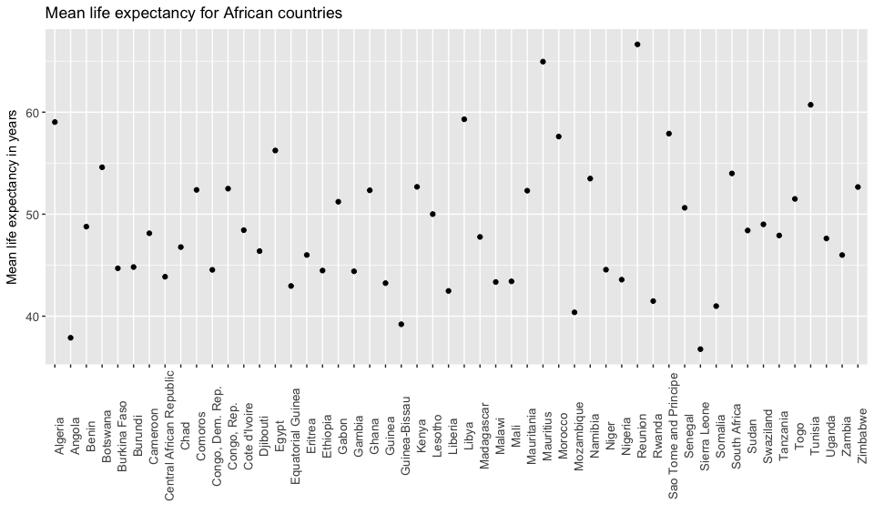
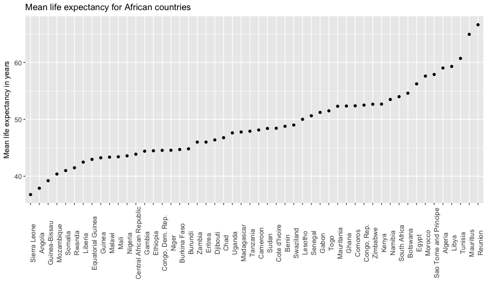
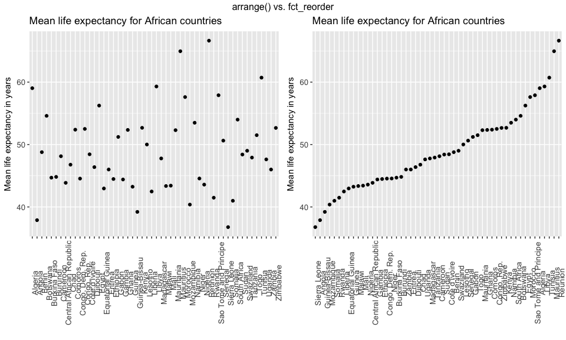

HW 05: Factor and figure management; Repo hygeine
================
Julian Heavyside
10/15/2017

-   [Factor management](#factor-management)
-   [File I/O](#file-io)

### Factor management

**Gapminder version: Drop Oceania. Filter the Gapminder data to remove observations associated with the continent of Oceania. Additionally, remove unused factor levels. Provide concrete information on the data before and after removing these rows and Oceania; address the number of rows and the levels of the affected factors.**

First, let's look at the structure of the dataset. What are the factors, how many levels are there, how many total observations, etc.

``` r
gapminder %>% 
  str()
```

    ## Classes 'tbl_df', 'tbl' and 'data.frame':    1704 obs. of  6 variables:
    ##  $ country  : Factor w/ 142 levels "Afghanistan",..: 1 1 1 1 1 1 1 1 1 1 ...
    ##  $ continent: Factor w/ 5 levels "Africa","Americas",..: 3 3 3 3 3 3 3 3 3 3 ...
    ##  $ year     : int  1952 1957 1962 1967 1972 1977 1982 1987 1992 1997 ...
    ##  $ lifeExp  : num  28.8 30.3 32 34 36.1 ...
    ##  $ pop      : int  8425333 9240934 10267083 11537966 13079460 14880372 12881816 13867957 16317921 22227415 ...
    ##  $ gdpPercap: num  779 821 853 836 740 ...

`country` has 142 levels (meaning there are 142 countries in the dataset) `continent` has 5 levels. We are tasked with dropping Oceania, which is a continent. Let's see what the `continent` level `Oceania` contains

``` r
oceania_only <- gapminder %>% 
  filter(continent == "Oceania")

oceania_only$country %>% 
  unique()
```

    ## [1] Australia   New Zealand
    ## 142 Levels: Afghanistan Albania Algeria Angola Argentina ... Zimbabwe

The continent Oceania only contains two countries: Australia and New Zealand. Interestingly, all the other countries are still preserved as levels. I'm not sure why this is, but I will try to figure it out! *edit: `droplevels()` will get rid of this vestigial info. Still not sure why it is preserved after we filter out Oceania! Also, I know this is in the instructions*

Let's drop Oceania, and therefore the two countries in it.

``` r
drop_oceania <- gapminder %>%
  filter(continent != "Oceania") %>% 
  # as tasked, the following line will remove the unused levels. 
  droplevels()

drop_oceania %>% 
  str()
```

    ## Classes 'tbl_df', 'tbl' and 'data.frame':    1680 obs. of  6 variables:
    ##  $ country  : Factor w/ 140 levels "Afghanistan",..: 1 1 1 1 1 1 1 1 1 1 ...
    ##  $ continent: Factor w/ 4 levels "Africa","Americas",..: 3 3 3 3 3 3 3 3 3 3 ...
    ##  $ year     : int  1952 1957 1962 1967 1972 1977 1982 1987 1992 1997 ...
    ##  $ lifeExp  : num  28.8 30.3 32 34 36.1 ...
    ##  $ pop      : int  8425333 9240934 10267083 11537966 13079460 14880372 12881816 13867957 16317921 22227415 ...
    ##  $ gdpPercap: num  779 821 853 836 740 ...

After dropping Oceania, we now only have 142 levels in `country` and 4 levels in `continent`, as expected.

**Reorder the levels of country or continent. Use the forcats package to change the order of the factor levels, based on a principled summary of one of the quantitative variables. Consider experimenting with a summary statistic beyond the most basic choice of the median.**

Focussing on the continent of Africa, we'll order the countries by life expectancy.

``` r
only_africa <- drop_oceania %>% 
  filter(continent == "Africa") %>% 
  select(continent, country, year, lifeExp, gdpPercap) %>%
  group_by(country) %>%
  droplevels()
```

We now have only 1 level in `continent` (as expected), and 52 levels in `country`. For the rest of the task, I'll only use `lifeExp` or `gdpPercap`, so I selected them.

Now let's make a plot with all 52 countries ordered along the x axis from lowest to highest life expectancy

``` r
only_africa %>% 
  # there are observations for many years, so I'll reduce these to a mean value
  summarise(avgLE = mean(lifeExp)) %>% 
  ggplot(aes(x = country, y = avgLE)) +
  geom_point() +
  ggtitle("Mean life expectancy for African countries") +
  xlab("") +
  ylab("Mean life expectancy in years") +
  theme(axis.text.x = element_text(angle = 90),
          axis.text = element_text(size = 10))
```



This is a start, but the countries are ordered alphabetically. We want them from lowest to highest life expectancy. I'll try to use `arrange()`

``` r
africa_arrange <- only_africa %>% 
  # there are observations for many years, so I'll reduce these to a mean value
  summarise(avgLE = mean(lifeExp)) %>% 
  # use `arrange()` here to try to reorder the countries
  arrange(avgLE) %>% 
  ggplot(aes(x = country, y = avgLE)) +
  geom_point() +
  ggtitle("Mean life expectancy for African countries") +
  xlab("") +
  ylab("Mean life expectancy in years") +
  theme(axis.text.x = element_text(angle = 90),
          axis.text = element_text(size = 10))

africa_arrange
```


Nothing happened! Upon googling tirelessly, I discovered that the default alphabetical ordering will take precedence over any reordering I did with `arrange()`. Failing to find a way to fix this with `dplyr` or `ggplot`, I'll use `fct_reorder()` from `forcats`. The only way I have figured out how to do it is to create a new `country` variable using `mutate()` before plotting instead of doing it while summarising (which I tried at first).

``` r
africa_fct <- only_africa %>% 
  summarise(avgLE = mean(lifeExp)) %>% 
  mutate(country = fct_reorder(country, avgLE)) %>% 
  ggplot(aes(x = country, y = avgLE)) +
  geom_point() +
  ggtitle("Mean life expectancy for African countries") +
  xlab("") +
  ylab("Mean life expectancy in years") +
  theme(axis.text.x = element_text(angle = 90),
          axis.text = element_text(size = 10))

africa_fct
```



Nice! Now we have a better sense of relativity in these countries. We can visually pick out the countries with the lowest, highest, or middle LE, or even precisely the 5th lowest country (Somalia), simply by counting along the x axis. We have to make sure not to interpret any trends yet, even though the line of dots is tricking the eye into thinking something is happening.

*this is why you should read the instructions before doing your homework* I now realize there is a note at the end of this task that tells us to try to arrange the data using `arrange()` before plotting, and then suggests that it might not work! Aha! Now I know. At least I eventually figured out that it was the problem...

``` r
grid.arrange(africa_arrange, africa_fct,
             ncol=2,
             as.table=TRUE,
             top="arrange() vs. fct_reorder")
```



### File I/O

Visualization design

Writing figures to file

Clean up your repo!

But I want to do more!
